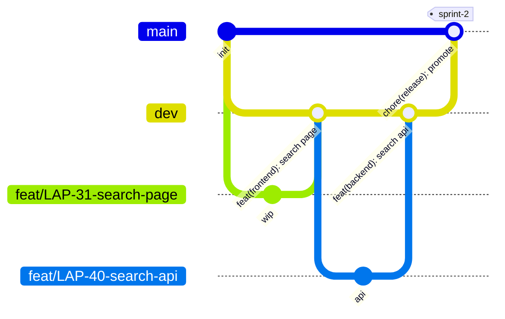

# Contributing to Day-Off

Short version: branch from `dev`, PR into `dev`, get 1 approval, squash-merge.
`dev` → staging. `main` → production. `main` only changes through a promotion PR.

## Start here

| You want to | Read |
|---|---|
| Run the project locally | `README.md` |
| Know the branching and PR rules | this file |
| Understand how the system fits together | `docs/ARCHITECTURE.md` |
| Know why a choice was made | `docs/adr/` |
| Do a recurring chore (API change, ADR, migration, docs) | `docs/playbooks/` |
| Know what your AI coding tool follows | `AGENTS.md` and the nested ones per folder |
| See every doc at once | `docs/README.md` |

New here? Read `README.md`, run `make setup`, then read this file top to bottom once.

## Branches and environments

| Branch | Deploys to | Database | Changes via |
|---|---|---|---|
| `feature/*` (PR) | Vercel preview URL | dev DB | your commits |
| `dev` (default) | staging URL | dev DB | squash-merged PRs |
| `main` | production URL | prod DB | promotion PR from `dev` (merge commit) |



## Daily flow

1. Pick a ticket in Jira, move it to **In Progress**.
2. `git switch dev && git pull`
3. `git switch -c feat/LAP-31-vibe-search-box`
4. Commit small, push often.
5. `make lint && make test` green, open a PR **into `dev`**.
6. 1 approval + checks green + threads resolved.
7. Author clicks **Squash and merge**. Branch auto-deletes.

Branches should live **< 3 days**. Big feature? Split it (see "Parallel work").

## Branch names

`<type>/LAP-<id>-<short-slug>` (lowercase slug, hyphens)

| type | use for |
|---|---|
| `feat` | new user-facing behavior |
| `fix` | bug fix on `dev` |
| `hotfix` | urgent fix on `main` (see below) |
| `chore` | tooling, deps, config, scaffolding |
| `docs` | docs, ADRs |
| `refactor` / `test` / `ci` | as named |
| `spike` | timeboxed research, may never merge |
| `data` | annotation, dataset, pipeline data work |

Examples: `feat/LAP-31-vibe-search-box`, `chore/LAP-19-init-frontend`

The pre-push hook rejects other names and any direct push to `dev` or `main`.

## Commits and PR titles

[Conventional Commits](https://www.conventionalcommits.org): `type(scope): summary`

- scopes: `frontend` `backend` `pipeline` `eval` `infra` `docs` `repo` `deps` `release`
- summary: imperative, lowercase, no period, <= 72 chars

**The PR title becomes the commit on `dev`** (squash). CI checks it.
Put the Jira key in the branch name and PR title or body. With the GitHub for Jira
app connected, the branch, commits and PR show up on the ticket automatically.
Add `#close` to a commit or PR title (`LAP-31 #close`) to transition the ticket on merge.

## Parallel work across layers

For a feature touching `pipeline/`, `backend/` and `frontend/`:

1. **Contract PR first**: request/response shape (Go structs + TS types). Merge to `dev`.
2. Everyone branches from `dev` and builds against the contract.
   Backend returns fake data, frontend uses a mock JSON file until the API lands.
3. Merge each PR when green, any order.
4. Final small PR swaps fake data for the real query.

Need a teammate's unmerged code? Wait for their PR first. If you can't,
branch from their branch, then `git rebase origin/dev` after it merges.

## Pull requests

- One ticket per PR. Aim for < 400 changed lines.
- UI change = screenshot. New env var = `.env.example` in the same PR.
- Schema change = migration file. **Never edit tables in the Supabase dashboard.**
- Architecture change = ADR in `docs/adr/`.
- Behind `dev`? Click **Update branch**, or `git fetch && git rebase origin/dev && git push --force-with-lease`

## Reviews

| rule | target |
|---|---|
| first response | within **24h** (weekdays) |
| blocked on review > 24h | ping in `#dev` thread |
| who reviews | anyone on the team may approve |
| after approval | **author** merges |

Comment prefixes: `blocking:` must fix, `nit:` optional, `q:` question.

## Promoting dev to main (release)

When: sprint end or before a demo. **No promotion within 48h of a demo** unless the team agrees.

1. Test staging end to end (2 people).
2. `make promote`. This opens the PR `dev → main` with the release checklist.
3. 1 approval + `lint`/`test`/`eval-gate` green.
4. Merge with **Create a merge commit**. **Never squash** a promotion.
   Squashing makes `main` and `dev` drift and the next promotion conflicts.
5. Prod migrations run, prod deploys. Smoke-test the prod URL.
6. Tag it:
   ```bash
   git fetch && git tag sprint-2 origin/main && git push origin sprint-2
   ```
   Tag names: `sprint-N`, `demo-proposal`, `demo-final`.

Something broke after promotion? Roll back the prod deploy to the previous tag's
build in Vercel first, then fix forward on `dev`.

## Hotfix (prod is broken, can't wait for next promotion)

1. `git switch main && git pull && git switch -c hotfix/LAP-55-fix-search-crash`
2. PR **into `main`**, 1 approval, merge commit.
3. **Immediately** run `make sync`. It opens a PR `main → dev` from a temp branch.
   Squash-merge it. Skip this and the fix disappears at the next promotion.

Never open a PR with `main` itself as the head branch (auto-delete could remove it).

## What CI enforces

| Check | Fails when |
|---|---|
| `lint` | Lint or TypeScript errors, a file over 1 MB, a data file (`.csv`, `.jsonl`, `.parquet`, weights) |
| `lint` | Go handler or route changed without touching `docs/api/openapi.yaml` (label `spec-exempt` to override, and say why) |
| `lint` | `docs/api/openapi.yaml` doesn't parse |
| `test` | Tests fail |
| `test` | `frontend/` fails `next build` |
| `test` | A migration in `supabase/migrations/` fails to apply to a fresh database |
| `pr-title` | Title isn't `type(scope): summary` |
| `eval-gate` | Retrieval quality drops (stub for now, required on `main`) |

## Docs that must move with your change

| You changed | Update |
|---|---|
| An endpoint | `docs/api/openapi.yaml` **in the same PR** |
| How components talk | `docs/ARCHITECTURE.md` |
| An expensive-to-reverse decision | New ADR in `docs/adr/` |
| A command or a hard rule | `AGENTS.md` (or the nested one for that folder) |
| Something that cost over an hour | `docs/LESSONS_LEARNED.md` |

Recurring chores have playbooks in `docs/playbooks/`: API changes, ADRs, migrations,
and which doc to update.

## What protects dev and main

| layer | what | where |
|---|---|---|
| local | block push to `dev`/`main`, branch names, `make lint` | `.githooks/pre-push` |
| CI | `lint`, `test`, `pr-title`, `eval-gate` | `.github/workflows/ci.yml` |
| GitHub | PR + 1 approval, merge method per branch, no force push/delete | rulesets `protect-dev`, `protect-main` |

GitHub rulesets only enforce once the repo is public. Until then, the first two
layers and these rules are what protect us. `git push --no-verify` = emergencies only,
announce it in `#dev`.

## Local setup

Prereqs: git, make, Docker, Node 22, Go, Python 3.12 + [uv](https://docs.astral.sh/uv/), [gh](https://cli.github.com).
Windows: use WSL2. Versions pinned in `.tool-versions`.

```bash
git clone git@github.com:the-lappers/day-off.git && cd day-off
make setup   # hooks, deps, .env (dev DB keys)
make dev     # full stack via docker compose
make help    # all commands
```

Full stack details: `docs/setup.md` (LAP-22).

## Commands (names are frozen, CI depends on them)

| command | does |
|---|---|
| `make setup` | install hooks + deps, create `.env` |
| `make dev` / `make down` | start / stop local stack (not the `dev` branch) |
| `make pipeline` | run the batch pipeline once |
| `make lint` / `make test` | lint / test all parts |
| `make eval` | nDCG@5 gate (stub for now) |
| `make secrets` | scan history for leaked keys |
| `make promote` | open release PR `dev → main` |
| `make sync` | back-merge `main → dev` after a hotfix |

## Never commit

- `.env` or any key. Prod keys live only in Vercel / host env settings and GitHub Secrets.
- Raw data, scraped reviews, photos, annotations, and all fetch/ingest code.
  Those live in the private `day-off-ingest` repo and private storage.
  CI fails any PR adding a data file or a file over 1 MB.
- Google Places data (NFR-L2). Model weights.
- Real review text in tests or CI logs (logs are public once the repo is).

Leaked a key? Rotate it **first**, then tell the team.
