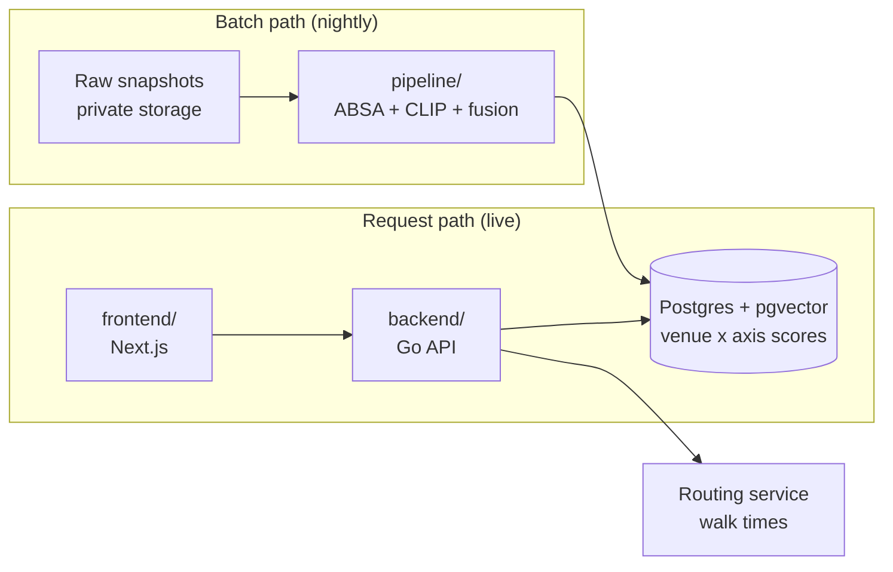

# Architecture

## The one idea

Nothing is computed at request time. A nightly batch job scores every venue on every
vibe axis and writes the result to Postgres. The API only reads. This is why the app
can rank a whole zone in under a second (NFR-P1) and return identical results for
identical queries (NFR-A4).

The two paths never call each other. Postgres is the interface (ADR-002, ADR-003).

## Components

| Component | Language | Job |
|---|---|---|
| `frontend/` | TypeScript, Next.js | Vibe search, venue detail, trip and route screens |
| `backend/` | Go | Ranking reads, trip CRUD, route solving, external routing calls |
| `pipeline/` | Python | Nightly: read raw snapshots, score venues, write the store |
| `eval/` | Python | Measures retrieval quality (nDCG@5) against a frozen gold set |
| Postgres + pgvector | Supabase | Venues, scores, evidence pointers, embeddings, trips |

## Request path

1. User submits free text plus a zone.
2. Go parses the query against the supported vibe axes.
3. Go reads precomputed scores for every venue in the zone and ranks by match strength
   (FR-302, FR-303).
4. Results return with tags and scores. Evidence stays in the database, unshown (ADR-006).
5. Trip and route requests use the precomputed travel-time matrix plus opening hours.

## Batch path

1. Fetch adapters in the private `day-off-ingest` repo write raw snapshots to storage.
2. `pipeline/` reads a snapshot, cleans and normalizes it.
3. Thai text scored with WangchanBERTa (aspect-based sentiment); photos scored with CLIP
   against axis descriptions.
4. Scores fused per venue per axis, with mention count, recency, and confidence.
5. Written to Postgres. The store is rebuilt at least every 24h (NFR-D1).

## Data boundaries

| Data | Where it lives | Never |
|---|---|---|
| App code | This repo | — |
| Fetch and scraping code | Private `day-off-ingest` repo | Never here |
| Raw reviews, photos, annotations | Private storage | Never in git |
| Scores, embeddings, trips | Postgres | Never in git |
| Google Places responses | Request-time only | Never stored, never training data (NFR-L2) |

## Environments

| Branch | Deploys to | Database |
|---|---|---|
| Pull request | Preview | Hosted dev |
| `dev` | Staging | Hosted dev |
| `main` | Production | Hosted prod |

Local development runs its own Postgres through the Supabase CLI, so there are three
databases in total. Schema changes reach all of them the same way: a migration file.
